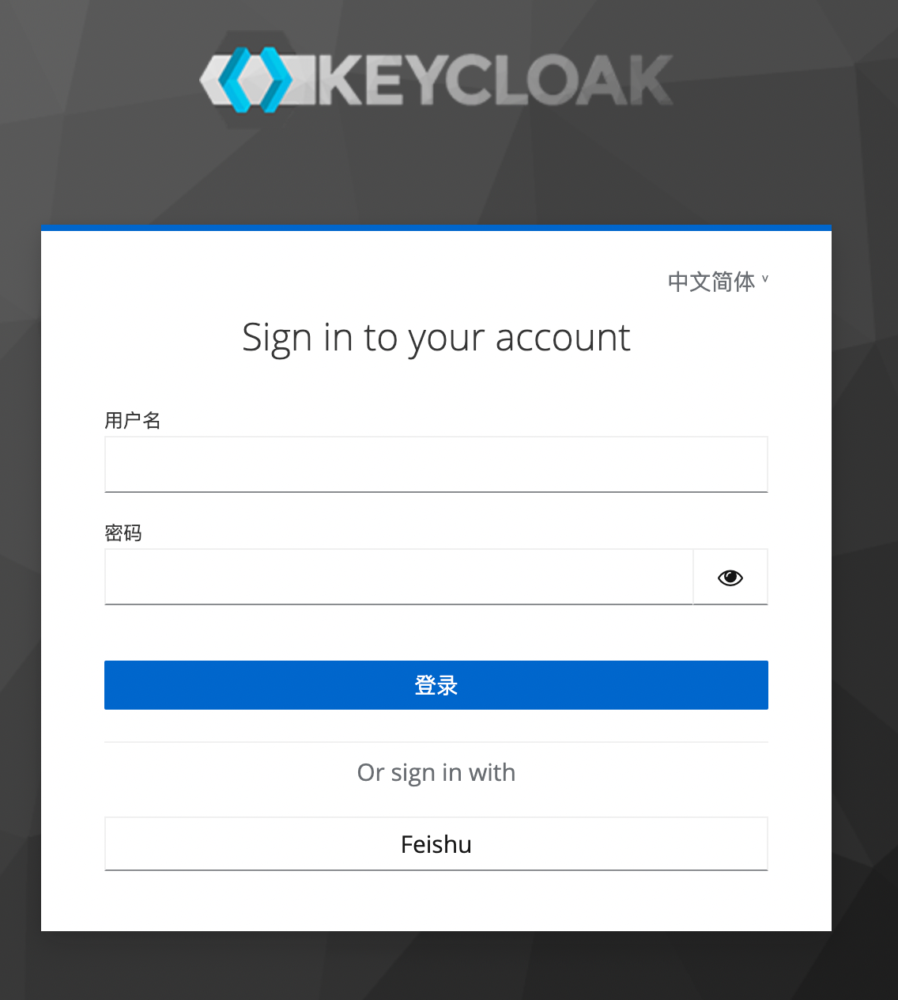
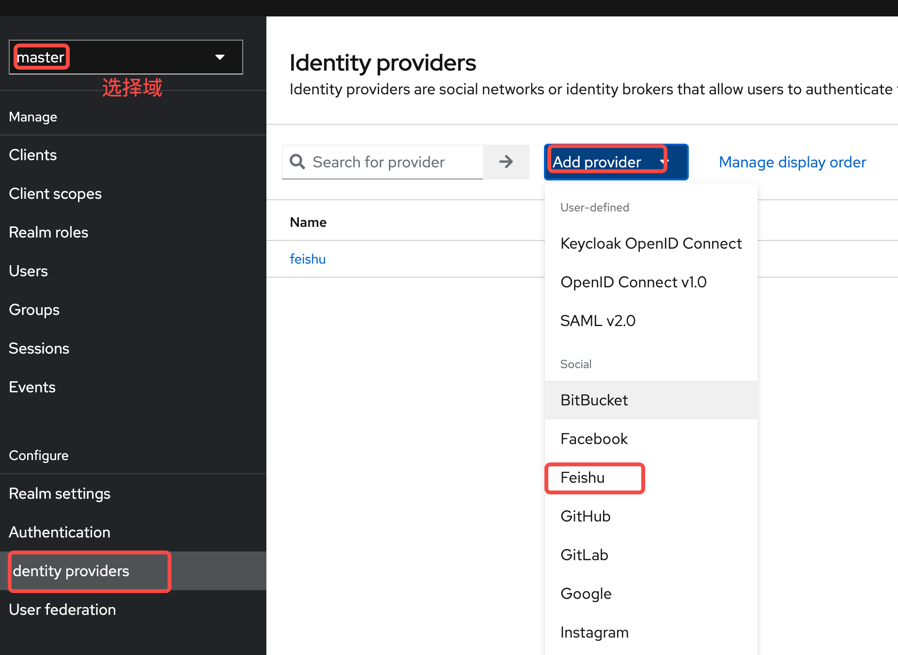
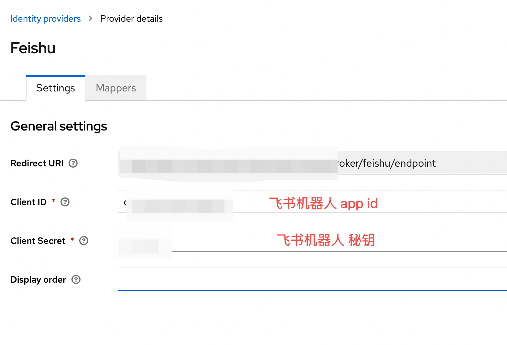
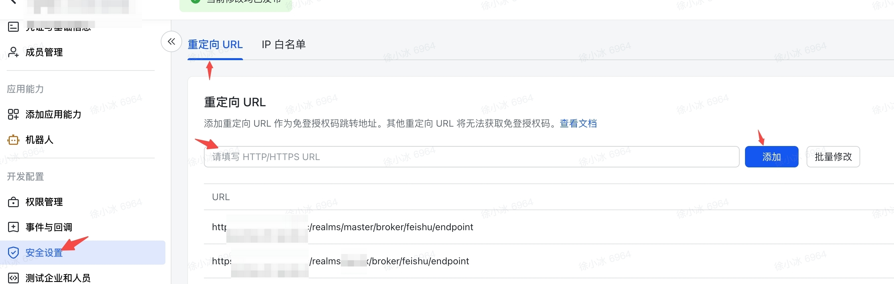

# keycloak-social-lark

将飞书做为Keycloak身份提供商（IDP）, 采用JDK17, 支持的keycloak版本23.0.4

需要在飞书开发者后台添加以下权限，并且需要发布应用
- 以应用身份读取通讯录
- 获取用户基本信息
- 获取用户 user ID
- 获取部门基础信息
- 获取部门组织架构信息
- 获取用户组织架构信息
- 获取用户性别
- 获取用户邮箱信息
- 获取用户手机号

飞书使用接口如下：
```java
    //OAuth2使用
    public static final String FEISHU_LOGIN_URL = "https://open.feishu.cn/open-apis/authen/v1/authorize";
    public static final String APP_TOKEN_URL = "https://open.feishu.cn/open-apis/auth/v3/tenant_access_token/internal";
    public static final String TOKEN_URL = "https://open.feishu.cn/open-apis/authen/v1/oidc/access_token";
    public static final String PROFILE_URL = "https://open.feishu.cn/open-apis/authen/v1/user_info";

    // 用于获取用户详情 一定要在末尾加 '/'
    public static final String USER_DETAIL_URL = "https://open.feishu.cn/open-apis/contact/v3/users/";
    public static final String DEPARTMENT_NAME_URL = "https://open.feishu.cn/open-apis/contact/v3/departments/";
```

# 编译安装To build:
```bash
mvn clean package
cp target/*.jar _KEYCLOAK_HOME_/providers/
```

# FeishuIdentityProvider 说明
飞书做为Keycloak IDP 身份提供商，在流程操作上有些麻烦，具体参考: https://open.feishu.cn/document/uAjLw4CM/ukTMukTMukTM/reference/authen-v1/login-overview
总结如下：
 * 获取 授权code
 * 根据 应用appId，App Secret (就是clientId和clientSecret) 获取 app_access_token
 * 根据 授权code 和 app_access_token 获取 user_access_token
 * 根据user_access_token获取用户信息

相对去其他IDP身份提供商，飞书多了一个步骤2, 这里可以覆盖父类中方法
 * 自定义类FeishuEndpoint，继承父类中Endpoint，覆盖方法generateTokenRequest，在这个方法中 步骤2，3
 * 覆盖父类方法callback，注入FeishuEndpoint

# 关于登陆页面
页面这部分采用默认页面


# 配置




# 飞书重定向设置

